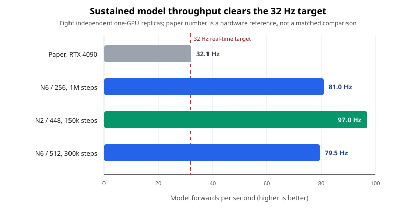
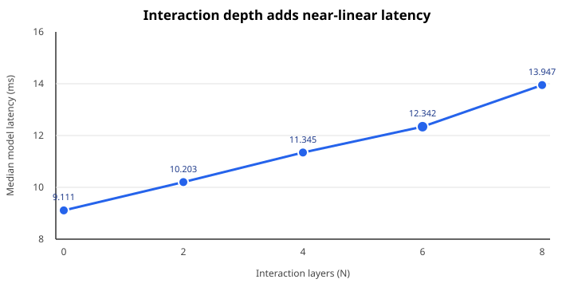
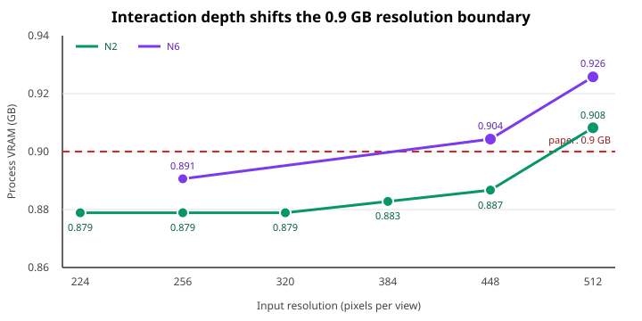
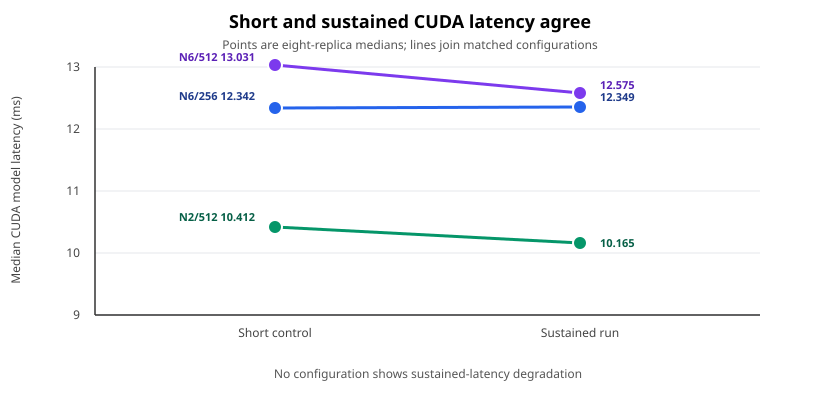
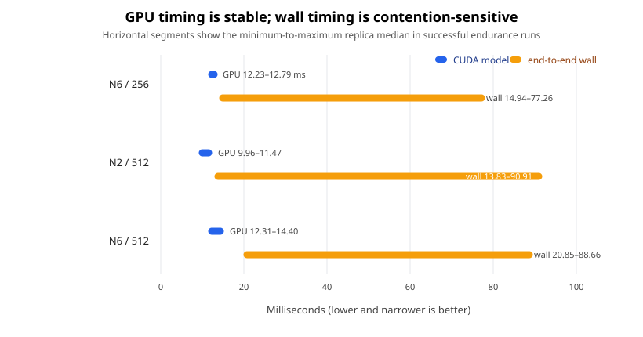

# TurboVLA efficiency reproduction

Robotic policies must turn camera images and spoken or written instructions into actions quickly enough to control a robot in real time. [TurboVLA](https://arxiv.org/abs/2607.27205)’s core idea is to keep that vision-and-language model unusually small and to predict a short sequence of actions at once, reducing both delay and memory use. This reproduction tests whether the released architecture actually has the reported efficiency scale, then asks which design choices preserve it.

## Verdict

**Partially reproduced.** Across 26 successful Kubernetes runs, the shape-faithful TurboVLA architecture was real-time on the available NVIDIA RTX PRO 6000 Blackwell GPUs: the paper-default configuration sustained **81.0 model forwards per second** and used **0.891 GB of process memory**, consistent with the paper’s 32 Hz and 0.9 GB scale. This is not an exact RTX 4090 reproduction, and it does not reproduce robot-task success because neither a trained TurboVLA checkpoint nor runtime access to the gated DINOv3 weights was available.

The scope is therefore architecture-level inference efficiency: parameter count, executed tensor shapes, GPU latency, memory, and output validity with shape-faithful random weights. The paper’s 32.1 Hz bar below is a reference from different hardware; the three colored bars are successful eight-replica endurance measurements.

**How to read this figure:** the dashed line is the minimum rate for 32 Hz control. Every sustained configuration clears it by more than twofold, including the canonical six-interaction-layer model at both 256- and 512-pixel input. The faster two-layer model is an efficiency variant, not a claim of equal task accuracy.

## Experimental setup

The measured path uses batch size 1, two camera views, a cached 32-token instruction representation, 12 predicted actions, and bfloat16 inference. “N6” denotes the paper-default six cross-modal interaction layers; “N2” is the lighter two-layer variant. Each endurance result aggregates eight independent one-GPU pods, and every successful replica produced finite, deterministic outputs of the expected 12-by-7 action shape.

The canonical model contains **0.216 billion total parameters**: 106.6 million in the online policy plus 109.5 million in the text encoder used to create the cached instruction representation. The paper reports 0.2 billion parameters, 31.2 ms latency, and 0.9 GB inference memory on an RTX 4090. We report GPU-event model time separately from end-to-end wall time so CPU scheduling cannot masquerade as model latency.

| Successful endurance condition | Work per replica | Model median | Rate | Process memory |
|---|---:|---:|---:|---:|
| N6, 256 px | 1,000,000 forwards | 12.349 ms | 80.98 Hz | 0.891 GB |
| N2, 448 px | 150,000 forwards | 10.305 ms | 97.04 Hz | 0.887 GB |
| N6, 448 px | 100,000 forwards | 12.646 ms | 79.08 Hz | 0.904 GB |
| N2, 512 px | 600,000 forwards | 10.165 ms | 98.38 Hz | 0.908 GB |
| N6, 512 px | 300,000 forwards | 12.575 ms | 79.52 Hz | 0.926 GB |

## What controls latency?

Interaction depth is the clearest design lever. In the matched 256-pixel sweep, increasing depth from zero to eight layers raises median model time from 9.111 to 13.947 ms and total size from 0.202 to 0.221 billion parameters. Each added pair of layers costs roughly 1.1–1.6 ms on this hardware, yet even N8 remains above 71 Hz.

Other tested knobs matter less. Changing the action horizon from 8 to 50 keeps throughput between 78.3 and 81.0 Hz. Cached instruction lengths through 128 tokens remain between 76.6 and 81.0 Hz; 256 tokens lowers the rate to 65.6 Hz, still above the target. Full per-condition measurements are in [results.csv](results.csv).

## Where is the memory boundary?

Resolution increases active image tokens, while deeper interaction repeatedly processes them. The N2 variant remains under 0.9 GB process memory through 448 pixels per view, reaching 0.908 GB at 512. Canonical N6 uses 0.904 GB at 448 and 0.926 GB at 512, so the strict “under 0.9 GB” result is supported for canonical 256 pixels and for N2 through 448 pixels—not for the larger canonical inputs.

Peak tensor allocation is much smaller than process memory: 0.223 GB for N6/256, 0.226 GB for N2/448, and 0.253 GB for N6/512. The difference includes framework, kernels, and allocator overhead, which is why process-level measurement is the relevant comparison to the paper’s memory claim.

## Do short benchmarks survive long runs?

Yes. Matched short and sustained medians differ by at most 0.46 ms across N6/256, N2/512, and N6/512. The longest successful arm executed eight million model forwards in aggregate, with replica medians tightly spanning 12.230–12.792 ms. There is no measured endurance slowdown.

End-to-end wall time is a different story. GPU-only replica medians occupy narrow ranges, whereas wall medians spread from roughly 14 to 91 ms because image preprocessing and CPU scheduling contend across the cluster. This does not invalidate the model-throughput result, but it shows that a full robot stack needs careful CPU provisioning to realize the GPU’s rate.

## Interpretation and limitations

The successful measurements support three bounded conclusions: the released model geometry is genuinely compact; its forward pass has ample real-time margin on Blackwell; and the paper’s memory scale is credible at the default resolution. They also reveal a practical trade-off: N2 buys about 20% higher sustained throughput and keeps 448-pixel inputs below 0.9 GB, while the paper chose N6 for learned performance.

The weights were random but shape-faithful. That preserves parameter count, tensor geometry, allocation, and executed kernels, but cannot test action quality or closed-loop robot success. Hardware also differs from the paper, so the measured 79–98 Hz rates must not be read as RTX 4090 numbers. Finally, wall-time contention came from this Kubernetes environment rather than a dedicated robot controller. The complete terminal-state classification—including five failed setup/aggregation attempts and two cancelled superseded attempts—is recorded in [run-ledger.csv](run-ledger.csv); only the 26 successful runs contribute measurements above.
